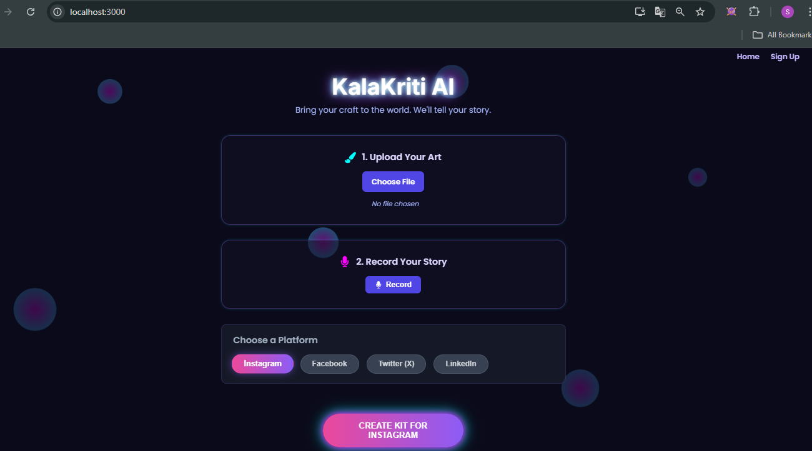
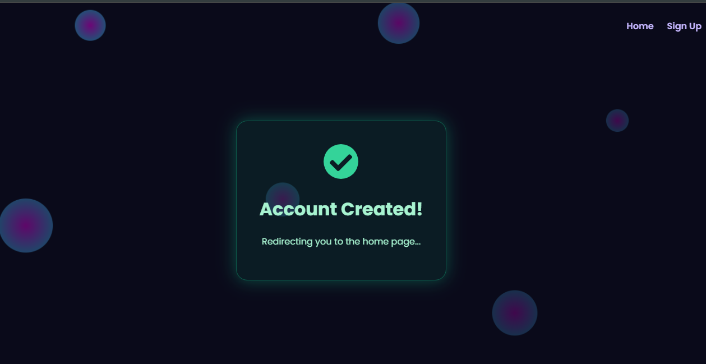
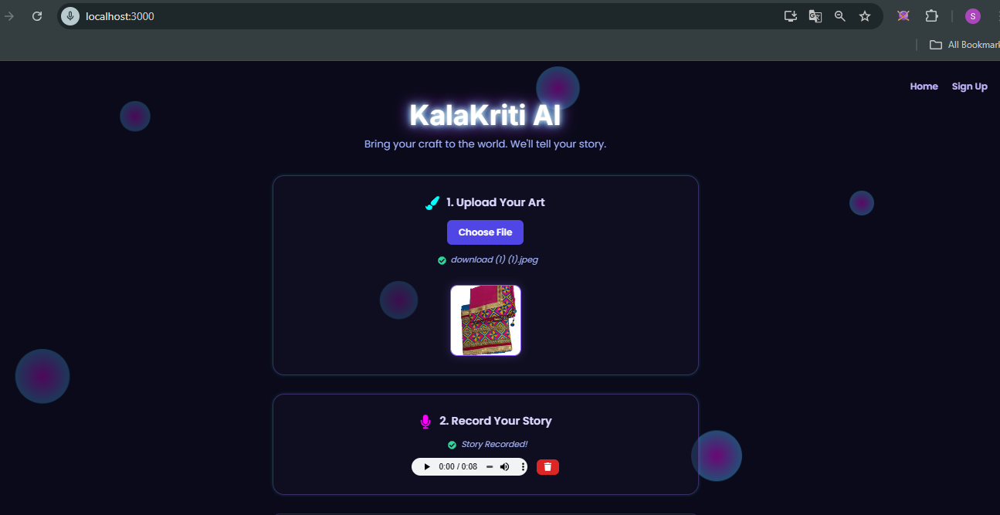

# 🎨 KalaKriti AI: The Artisan’s Digital Voice

<div align="center">


> **🏆 Project Contest Submission 2025**
> *Bridging the gap between traditional craftsmanship and the global digital marketplace.*

[📂 Drive Link to Project Docs](#) | [🎥 Watch Demo Video](#)

</div>

---

## 📖 Project Overview
**KalaKriti AI** is a Generative AI-powered marketing assistant designed specifically for rural artisans. 

Millions of artisans create beautiful products but struggle to sell them online due to language barriers and a lack of digital marketing skills. **KalaKriti AI solves this.** It allows artisans to upload a **photo** of their craft and record a **voice story** in their native language. 

Using **Google's Gemini 2.5 Multimodal AI**, the system analyzes the visual aesthetics and the emotional context of the audio story simultaneously to generate a professional, viral-ready marketing kit (Title, Description, Story, Hashtags) in seconds.

---

## 📸 Visual Walkthrough

### 1. The Experience: Modern & Accessible
*A particle-animated, dark-mode interface designed for ease of use. The glowing aesthetic ensures a premium user experience.*
<div align="center">
  
</div>

<br>

### 2. Secure Authentication System
*We prioritize user security with robust validation. The system includes route protection (Middleware) to ensure only logged-in users can generate AI content.*

| **Signup & Validation** | **Success Feedback** | **Route Security** |
|:---:|:---:|:---:|
|  |  |  |
| *Real-time form validation* | *Instant visual confirmation* | *Protected Route Guarding* |

<br>

### 3. Multi-Modal Input Workflow
*The core innovation: Artisans upload visual art and record oral history simultaneously.*

**Step A: Visual & Audio Input**
<div align="center">
  
</div>
<br>

**Step B: Platform Optimization**
*User selects the target social media platform to tailor the hashtag strategy.*
<div align="center">
  
</div>

<br>

### 4. The Magic: AI Result Generation
*Gemini 2.5 generates a "Marketing Kit" with catchy titles, emotional storytelling, and platform-specific hashtags.*
<div align="center">
  
</div>

<br>

### 5. Backend Database
*We utilized **Google Firebase** for our database needs.*
<div align="center">
  
</div>

> **Why Firebase?** > We chose Firebase Authentication and Firestore because it offers **enterprise-grade security** for handling user credentials (email/password) without managing complex server-side sessions. It also provides real-time data synchronization, ensuring the user state is instantly updated across the app.

---

## ✨ Key Features
* **🗣️ Voice-to-Viral:** Artisans can speak in their native tongue (Hindi/Punjabi); the AI extracts cultural keywords (like *Phulkari*, *Banavat*) and weaves them into English marketing copy.
* **👁️ Multi-Modal Analysis:** Uses Gemini 2.5 Flash to "see" the image colors/patterns and "hear" the artisan's emotion at the same time.
* **📱 Platform Optimized:** Generates hashtags specifically tailored for Instagram, Facebook, or Twitter.
* **⚡ Zero-Latency Preview:** Instant image thumbnails and browser-native audio recording (WebM) without heavy server processing.
* **🔐 Secure Auth:** Full Signup/Login system powered by Firebase.

---

## 🛠️ Tech Stack

| Component | Technology Used | Description |
| :--- | :--- | :--- |
| **Frontend** | **React.js** | Dynamic Single Page Application (SPA) with real-time previews. |
| **Backend** | **Python Flask** | Lightweight REST API to handle image/audio processing. |
| **AI Model** | **Google Gemini 2.5 Flash** | Multi-modal model for analyzing Audio + Vision together. |
| **Database** | **Google Firebase** | Secure Authentication & Real-time NoSQL cloud database. |
| **Audio** | **Web Audio API** | Native browser recording (MediaStream) for high fidelity. |

---

## 🚀 How to Run Locally

Follow these steps to set up the project on your machine.

### Prerequisites
* **Node.js** & **npm** installed
* **Python 3.8+** installed
* A **Google Gemini API Key**
* A **Firebase Project** setup

### Step 1: Clone the Repository
```
git clone [https://github.com/your-username/kalakriti-ai.git](https://github.com/your-username/kalakriti-ai.git)
cd kalakriti-ai
```
### Step 2: Setup Backend (Flask)
Navigate to the backend folder and install dependencies.
```
cd Backend

# 1. Create virtual environment (Recommended)
python -m venv venv

# 2. Activate Virtual Environment
# Windows:
venv\Scripts\activate
# Mac/Linux:
source venv/bin/activate

# 3. Install dependencies
pip install -r requirements.txt

# 4. Configure Environment
# Create a file named .env inside the Backend folder and add your API Key:
echo "GOOGLE_API_KEY=your_actual_api_key_here" > .env

# 5. Run the server
python main.py
The Server will start on http://127.0.0.1:5000
```

### Step 3: Setup Frontend (React)
Open a new terminal, navigate to the frontend folder.
```
cd Frontend

# 1. Install node modules
npm install

# 2. Start the React App
npm start
The App will launch on http://localhost:3000
```

## 📂 Code Structure
```
KalaKriti-Ai/
├── Backend/
│   ├── services/
│   │   └── marketing_copilot.py   # Main AI Logic (Gemini 2.5 Integration)
│   ├── main.py                    # Flask API Entry Point & CORS Setup
│   └── requirements.txt           # Python Dependencies
├── Frontend/
│   ├── src/
│   │   ├── components/
│   │   │   ├── AudioRecorder.js   # Native Audio Recording Logic
│   │   │   └── AuthForms.js       # Login/Signup Logic
│   │   ├── firebase.js            # Firebase Configuration
│   │   ├── App.js                 # Routing & Layout
│   │   ├── HomePage.js            # Main UI Controller & API Calls
│   │   └── index.css              # Dark Mode Styles
│   └── package.json
├── screenshots/                   # Project Images
└── README.md
```
## 👨‍💻 Team Details
Team Name: Tech Crafters
```
Sahil Kumar (Roll No: 2201688) - Full Stack Developer & AI Integration
```
Made with ❤️ for Indian Artisans.
